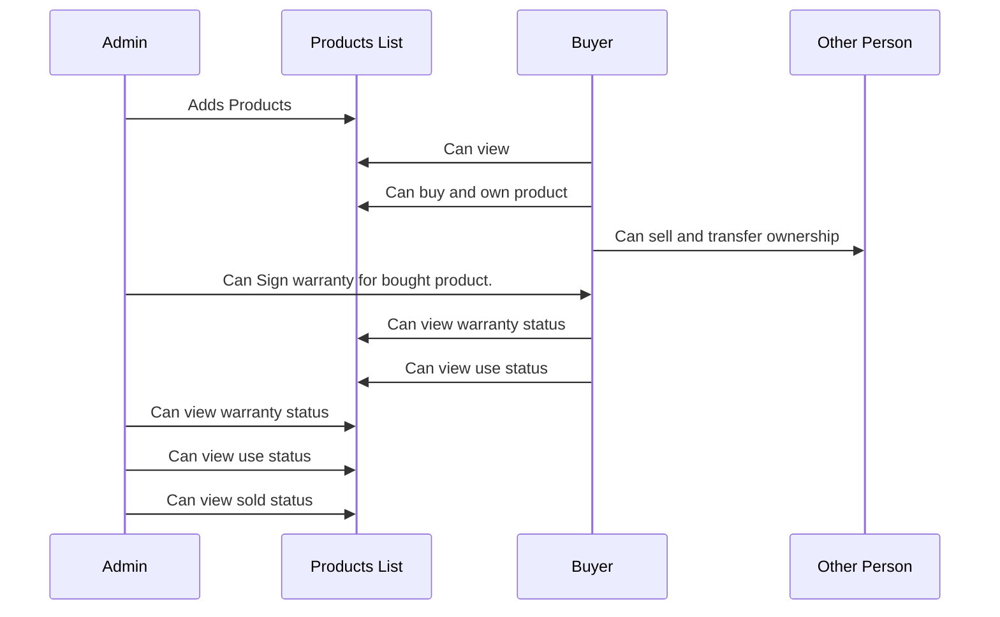

# Smart Warranty system using blockchain

## Setup Instructions

1. Clone the repository on your local machine using `git clone https://github.com/YuvrajMann/Grid-Blockchain-Backend.git`
2.  Run `npm install` to install all dependecies.
3. Install [ganache-cli](https://www.npmjs.com/package/ganache-cli) on you local machine and run it
4.  Make a file with name .env and following contents in it    
``
DB= [The name of the cloud databse]`` 
``LDB=[Name of the local databse]   `` 
``secretKey=12345-67890-09876-54321``
5. Install [truffle](https://www.npmjs.com/package/truffle) on your machine
6. Run command `truffle compile` to compile all smart contracts
7. Run command `truffle migrate --reset` to migrate all contracts to blockchain network
8. Run `npm run start` command to start the server

***Postman link to all API's***
https://www.getpostman.com/collections/5edf8a39b0fd7e949344 

## Application Flow Diagram

## Application Architecture

